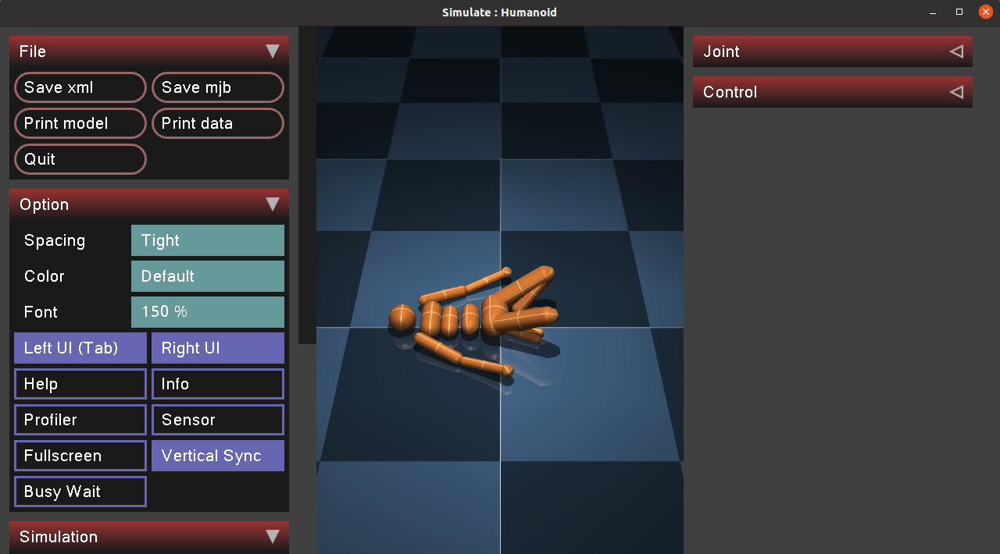
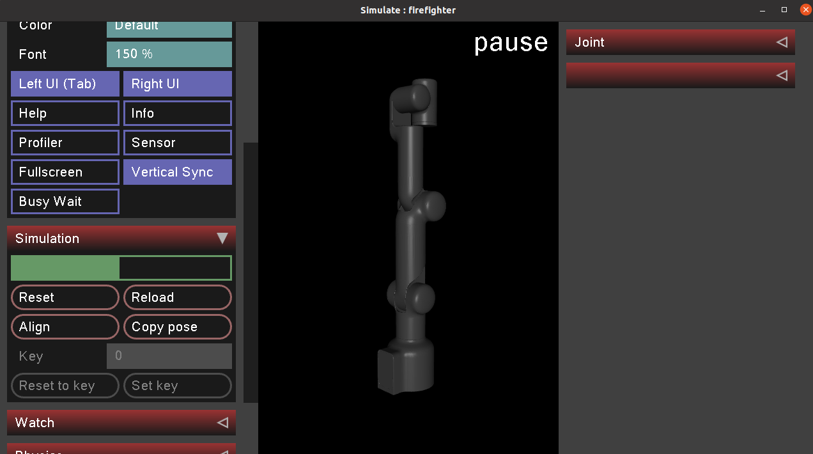

# mercury_mujoco
Load the robot model in the mujoco simulation platform

# Usage environment
Linux Ubuntu 20.04

# Installation of mujoco210

1. Download the binaries for MuJoCo version 2.1 for Linux: [Download mujoco210](https://github.com/google-deepmind/mujoco/releases/download/2.1.0/mujoco210-linux-x86_64.tar.gz)

2. In the `home` directory, create a hidden folder `/.mujoco`

    ```bash
    mkdir ~/.mujoco
    ```

3. Unzip the downloaded directory of `mujoco210` to the `~/.mujoco/` path.
4
    ```bash
    cp mujoco210-linux-x86_64.tar.gz ~/.mujoco
    tar zxvf mujoco210-linux-x86_64.tar.gz
    ```
4. Add environment variables at the end of .bashrc file

    gedit ~/.bashrc

    ```bash
    export LD_LIBRARY_PATH=~/.mujoco/mujoco210/bin
    ```
    source ~/.bashrc

5. Test whether the installation is successful

    ```bash
    cd ~/.mujoco/mujoco210/bin
    ./simulate ../model/humanoid.xml
    ```
    

# Installation of mercury_mujoco

- Use git to clone repository address, enter the command:

```bash
git clone https://github.com/elephantrobotics/mercury_mujoco.git
```

- Load model file in mujoco

```bash
cd ~/.mujoco/mujoco210/bin
./simulate ~/mercury_mujoco/xml/mercury_a1_mujoco.xml
```

